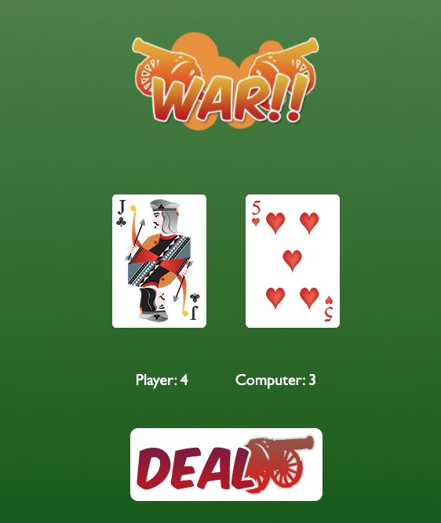

# High-Card



## Instructions
Create a browser-based card game where a player plays cards against a computer.  

### User Stories/game logic

- The player should be able to draw a card from their hand and then it should be displayed against a computer's card.

- The highest card Wins and they get a point. So the User and Comp should have their scores displayed and updated each turn.

- The game should be at least 13 cards with values from 2 to 14 (refer to /images).

- Make sure the cards come out in a different order each time you play the game.


### Setup 

- Check that your index.html and your .js and .css files are all linked up. If you did this correctly, you should see a green background with the logo War!! when you open the index.html in your browser.


### Steps to consider
 -Create a `div` with the class of `container` to contain all of the parts of the game.

 ```
// Create container element
let container = document.createElement('div');

container.setAttribute('class', 'container');

// Append to DOM
document.body.appendChild(container)
 ```

 -Create two `img` tags that will show the player card, and the computer card. Set the class attribute to `playerCard` and `cpuCard`, append the card elements to the `container`:

```
// Create card elements
let playerCard = document.createElement('img');
playerCard.setAttribute('class','playerCard');
playerCard.setAttribute('src','./images/back.png');

// Append playerCard to Container
container.appendChild(playerCard);

// Do the same for cpuCard
```

 -Add a `div` with class `scoreContainer` and append to the document body:

 ```
// Create Score Container
let scoreContainer = document.createElement('div');
scoreContainer.setAttribute('class','scoreContainer')
document.body.appendChild(scoreContainer);
 ```

 -Add two new `div` elements of class `playerScore` and `cpuScore`.

```
 // Create Player Score
let playerScore = document.createElement('div');
playerScore.setAttribute('class','playerScore');
playerScore.innerHTML="Player: 0";
scoreContainer.appendChild(playerScore);

// Do the same for cpuScore
```

 -Add a `button` with class `dealButton`, append to the document body:

 ```
// Create Deal Button
let dealButton = document.createElement('button');
dealButton.setAttribute("class", "dealButton");
document.body.appendChild(dealButton);
 ```

 If you followed all the prior steps correctly, you should get something that looks like this:
 
 

 If you got this result, you're good to start adding the game functionality. Refer to the next steps to add functionality to your game!

### Functions to consider
<em>These could easily be done with OOP as opposed to functional programming.</em>

-Create a function to reorder the deck randomly

-Create game logic to hold a player, and computer score

-Create function to listen for the 'click event'

-Create functions to determine the winnder of a round

-Create a function to assign the computer, and the player a card

-Do the neccessary DOM manipulation to display the cards played

-Determine game logic to decide ona winner after a predetermined number of plays

